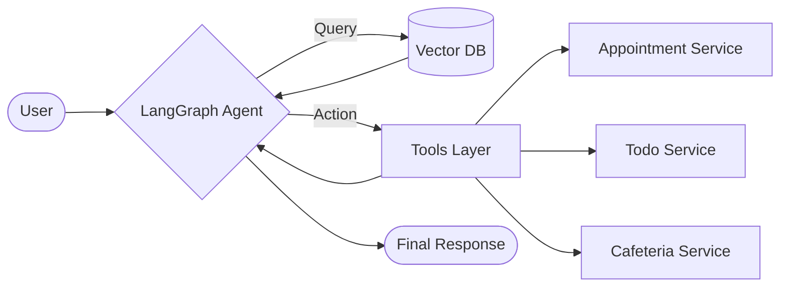

# UniAssist

UniAssist is a comprehensive **Autonomous AI Campus Super-App** designed to streamline university life. It serves as a central hub for students and faculty, combining a powerful **Agentic AI concierge** with over 12 essential campus utilities—from real-time chat to productivity tools.

---

## The Core: Autonomous AI Agent

At the heart of UniAssist is an intelligent agent built with **LangGraph** and **RAG (Retrieval-Augmented Generation)**. Unlike standard chatbots, this agent can **take action** on behalf of the user.

### Key Capabilities
- **Context-Aware Answers**: Uses **Vector Search (MongoDB)** to retrieve accurate campus info (e.g., "Where is Dr. Chady's office?", "What's on the lunch menu?").
- **Autonomous Actions**: proactively executes tasks via tool calling:
    - *"Book a meeting with the Dean next Tuesday"* → Checks availability & Books Appointment.
    - *"Remind me to submit the assignment"* → Creates a prioritized Todo.
- **LangGraph Architecture**: Orchestrates complex, multi-step workflows (Reasoning → Tool Execution → Response).



---

## Features Ecosystem

UniAssist consolidates a fragmented campus experience into a single, scalable platform.

### Communication & Community
- **Real-Time Chat**: Direct messaging with students and teachers, powered by **Socket.io** for sub-100ms delivery.
- **Announcements System**: Official campus news feed to keep everyone updated.
- **Lost & Found**: Community board for reporting and recovering lost items.

### Scheduling & Academic Life
- **Smart Appointment System**: Book office hours with professors; teachers can accept/reject requests.
- **Class Schedule**: Visual weekly planner for monitoring courses.
- **Notifications**: Real-time alerts for appointments, messages, and deadlines.

### Productivity Suite
- **Pomodoro Timer**: Built-in focus timer to boost study sessions.
- **Smart Todos**: Task manager with priority levels and due dates (AI-integrated).
- **Notes App**: Rich-text note-taking for lectures.

### Campus Life
- **Cafeteria Menu**: Daily breakfast, lunch, and dessert menus (AI-queryable).
- **Contact Us**: Direct line to administration departments.

---

## Technology Stack

### Backend
- **Runtime**: Node.js, Express.js
- **AI Core**: LangChain.js, LangGraph, OpenAI (GPT-4o)
- **Database**: MongoDB (Data + Vector Store)
- **Real-time**: Socket.io
- **Security**: JWT Authentication, RBAC (Role-Based Access Control)

### Frontend
- **Framework**: React.js (Vite)
- **Styling**: Material-UI (MUI), Tailwind CSS
- **State Management**: Zustand
- **Scheduling**: React Big Calendar

---

## Getting Started

1.  **Clone the Repository**
    ```bash
    git clone https://github.com/yourusername/uniassist.git
    cd uniassist
    ```

2.  **Install Dependencies**
    ```bash
    npm install
    cd frontend && npm install && cd ..
    ```

3.  **Environment Setup**
    Create a `.env` file in the root directory:
    ```env
    PORT=5000
    MONGO_DB_URI=your_mongodb_connection_string
    JWT_SECRET=your_jwt_secret
    OPENAI_API_KEY=your_openai_api_key
    ```

4.  **Seed AI Knowledge Base**
    Populate the vector database with campus information:
    ```bash
    node backend/Seeder/seedKnowledge.js
    ```

5.  **Run the App**
    ```bash
    npm run server
    # Runs backend on port 5000 and frontend on port 3000
    ```

---

## Contribution
Contributions are welcome! Please fork the repository and submit a pull request.
